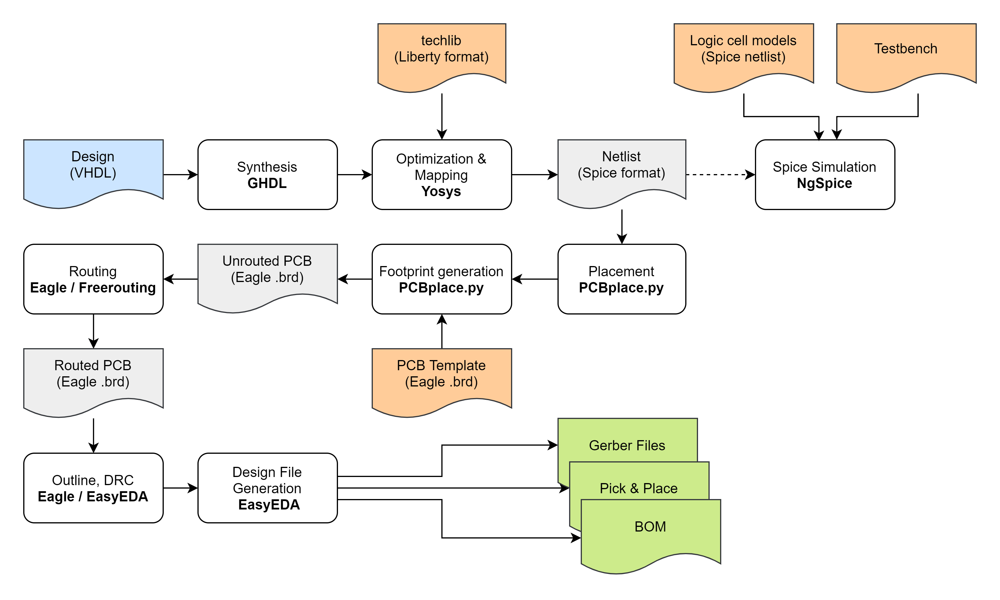

# PCBFlow

Highly experimental set of scripts to transform a digital circuit described in a hardware description language (VHDL or Verilog) into a discrete transistor circuit on a PCB. (Disclaimer: I don't know what I am doing)

Makes use of:
-   GHDL
-   Yosys 
-   ABC
-   GTKView
-   NGspice
-   PCBPlace - my own P&R tool written in Python
-   Freerouting (Optional)
-   Eagle (Optional)
-   EasyEDA (Optional)

Should work in a Linux shell. I am currently using WSL2. 

For details see [Project logs on HaD.io](https://hackaday.io/project/180839-vhdlverilog-to-discrete-logic-flow)

## Flow Architecture

