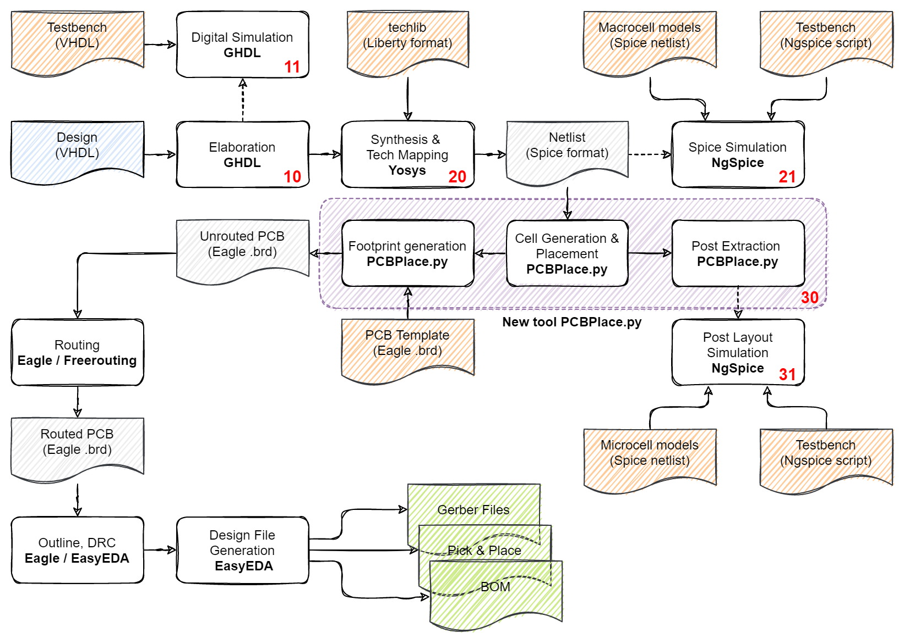
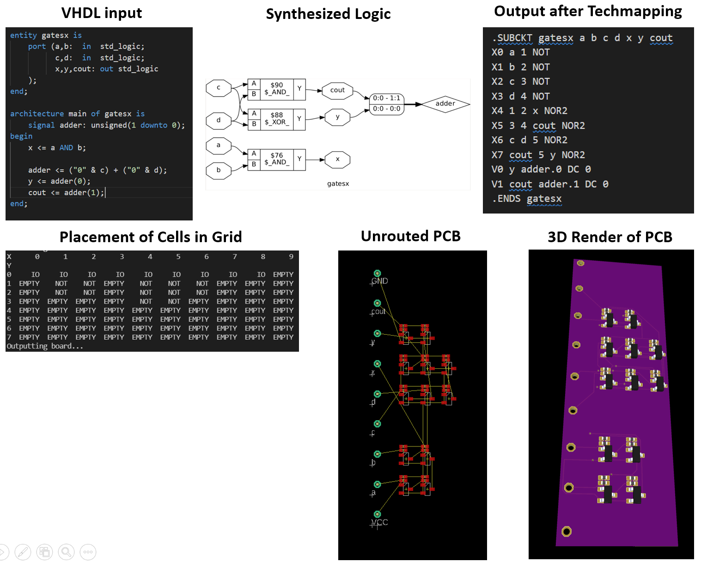
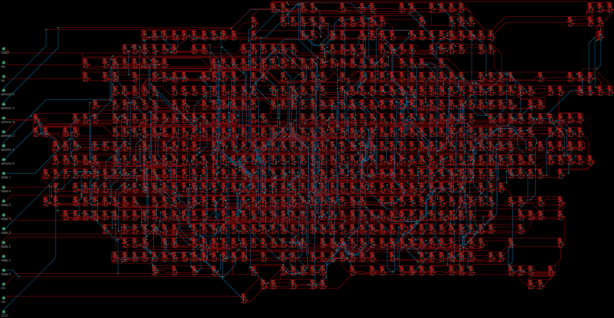

# PCBFlow

Highly experimental set of scripts and a placement tool written in Python that transform a digital circuit described in a hardware description language (VHDL or Verilog) into a discrete transistor circuit on a PCB (Disclaimer: I don't know what I am doing). To be regarded as proof-of-concept.

Makes use of:
-   GHDL
-   Yosys 
-   ABC (Integrated in Yosys)
-   GTKView
-   NGspice
-   Python3 (Packages: lxml, pandas)
-   PCBPlace - my own placement tool written in Python
-   Freerouting (Optional)
-   Eagle (Optional)
-   EasyEDA (Optional)

Should work in a Linux shell. I am currently using WSL2. 

For details see [Project logs on HaD.io](https://hackaday.io/project/180839-vhdlverilog-to-discrete-logic-flow)

# Flow Architecture

The diagram above shows how the individual steps of the flow are connected. The starting point is the design (A VHDL source file) in the blue file box. In subsequent steps, this design will be transformed by various tools into new intermediate representations (grey). To aid this, technology description files and testbenches are needed (orange). The output at the end of the flow are the three green files, which describe the PCB layout (Gerber), the part list (BOM) and where the parts have to be placed on the PCB (Pick & Place).

At the core of the flow is PCBPlace.py, which is a placement and footprint generation tool written in Python. The remaining steps are covered by existing Open-Source or freely accessible Tools.

Right now, everything is based on shell scripts that have to be invoked manually. The numbers in the process boxes indicate the number of the script that performs this step. Scripts ending on zero (10,20,30) are mandatory steps for the flow, scripts ending on other digits are optional, e.g. for intermediate simulation.

The technology description files and additional data reside in subfolders [10_HDL](10_HDL/), [20_SYNTH](20_SYNTH/), [30_PLACE](30_PLACE/). [10_HDL](10_HDL/) also holds the design files. All intermediate and output files are stored in the [Work](Work/) folder. It can be cleaned by calling the "clean_all.sh" script.

The output of the automated part of the flow is an unrouted PCB. Routing and design file generation has to be invoked manually with the indicated tools. Please be aware that the placement tool is in a very early experimental stage. Constants in the code may have to be tuned for better results depending on input design.

# Examples

The image below shows a basic example, implementing a full adder and an AND gate, going from source code via intermediate representations to the final 3D rendered PCB.

As a more complex example, you can see the synthesized [MCPU](https://github.com/cpldcpu/MCPU) below. The design consists of 771 transistors and twice as many resistors. Routing was performed with Freerouting. In the current state there is no optimization of power grid or insertion of decoupling capacitances, most likely severely limiting the speed of such a large design.

